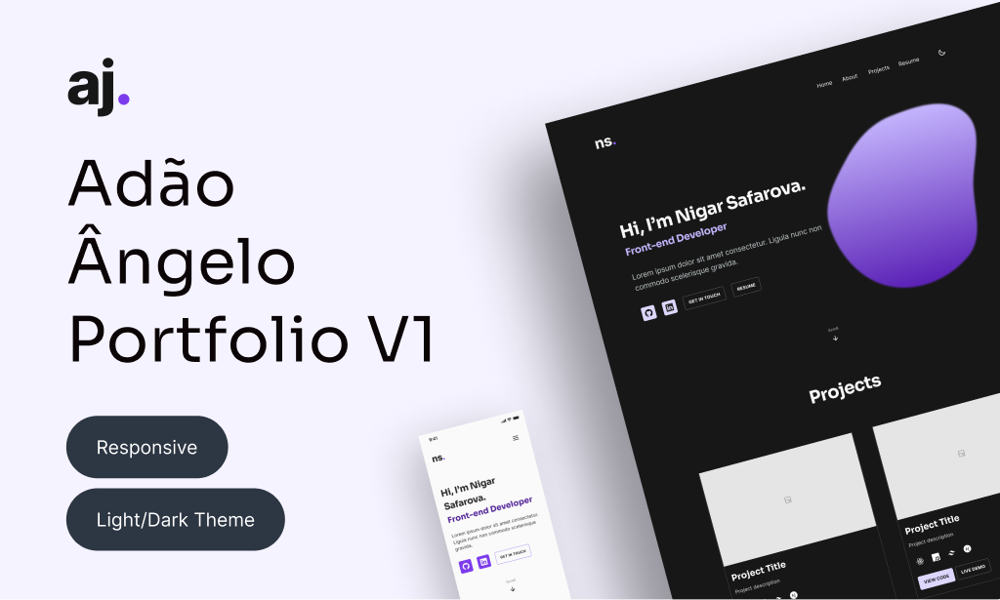

# 🖥️ Personal Portfolio

A modern and responsive developer portfolio built using **Next.js**, **TypeScript**, and **Tailwind CSS**. This project showcases my skills, projects, and experience in a clean and visually appealing way.

---

## 🚀 Features

- **Responsive Design**: Fully responsive layout optimized for desktops, tablets, and mobile devices.
- **Modern Tech Stack**: Built with Next.js for performance, TypeScript for type safety, and Tailwind CSS for rapid styling.
- **Projects Showcase**: Highlights my featured projects with descriptions, technologies used, and links.
- **Contact Section**: Includes a contact form and links to my social media profiles.
- **Dark Mode**: A sleek dark mode theme for better accessibility and modern design.

---

## 🛠️ Technologies Used

| Technology         | Description                                          | Icon                                                                                      |
|---------------------|------------------------------------------------------|------------------------------------------------------------------------------------------|
| **Next.js**        | React framework for building modern web applications. |          |
| **TypeScript**     | Typed superset of JavaScript for scalable development. | |
| **Tailwind CSS**   | Utility-first CSS framework for rapid UI development. | |

